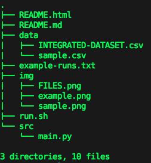
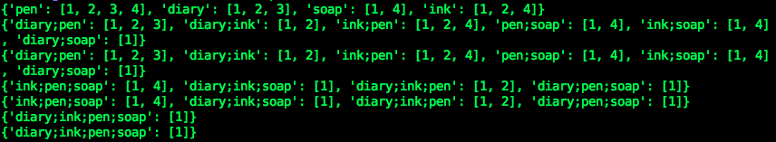

A-Priori Association Rule Extraction
=====================

Tong Ge (tg2473)

Yi Wang (yw2580)

##Files Hierachy



####(a) Which NYC Open Data data set(s) you used to generate the INTEGRATED-DATASET file?
311 Service Requests from 2010 to Present
All 311 Service Requests from 2010 to present. This information is automatically updated daily.

Row number: 16272

URL:
https://data.cityofnewyork.us/Social-Services/311-Service-Requests-from-2010-to-Present/erm2-nwe9?

####(b) What (high- level) procedure you used to map the original NYC Open Data data set(s) into your INTEGRATED-DATASET file?

We filter the original large data set by restricting the "Created Date" between two days before black friday last year (Nov. 27th, 2013) to the Dec. 1st, 2013.

In addition, we delete the columns that look like containing useless information, e.g., "unspecified", "N\A. The final columns left are "Agency Name", "Complaint Type", "Descriptor", "Incident Zip", "City", "Community", "Borough".

####(c) What makes your choice of INTEGRATED-DATASET file interesting (in other words, justify your choice of NYC Open Data data set(s)).

The data set is about service requests in New York, and days between the Nov. 27th, 2013 and Dec. 1st, 2014 are interesting because many people from all over the world would visit New York, and people are more likely to go out for shopping. 

We expected to derive some interesting rules from the dataset, e.g., what's the main complain problem in New York at that time, the Agency for dealing with this problem, the location distribution of the problem.


###How to run

```
> chmod +x run.sh [optional]
> ./run.sh -o output -s min_sup -c min_conf -d dataset 

usage: Main.py [-h] [-S MIN_SUP] [-C MIN_CONF] [-D CSVDATA] [-O OUTPUT]

<Usage> 

optional arguments:
  -h, --help            show this help message and exit
  -S MIN_SUP, -s MIN_SUP
                        <min_support>
  -C MIN_CONF, -c MIN_CONF
                        <min_confidence>
  -D CSVDATA, -d CSVDATA
                        <dataset file name>
  -O OUTPUT, -o OUTPUT  <stdout or file>
```
e.g., 


In default, the program will execute our INTEGRATED-DATASET.csv with min_support=0.2, min_confidence=0.8 and the result will be list in the terminal.

If you want to change to other dataset, put the dataset in the **data** folder and specificy the argument in the command list.

###Internal Design

Internally, we implemented the original algorithm desribed in Section 2.1 of the Agrawal and Srikant paper in VLDB 1994 with minor modications. Our pseudocode, similar to section 2.1.1 are given below, here we omit the internal function of ```apriori-gen``` and ```FILTER```.

**Pseudocode**
```
L1 = {large 1-itemsets};
Answer[0] = L1
k=2;
while(Answer.length >= k-1)
{
	Lk_1 = Answer[k-2]; 
	Ck = apriori-gen(L);
	Lk = FILTER(Ck);
	if(Lk!=NULL)
	{
		Answer.append(Lk);
	}
}
```
In particular, instead of scanning transcations over and over again in ```apriori-gen``` procedure. We always maintain inverse words list data structure, in which we place the words or words sequences as key, their corresponding apperance transcations as value. Thus it's more efficient since we only have to compare, intersect, merge the **transaction lists** to performance certain operations. e.g., the sample inverse words list:



Moreover, our join procedure in ```apriori-gen``` is based on alphabetical order.

###Derived interesting rules
From the example-run.txt, we conclude that:

#### Frequent itemsets
1.The top 3 frequent agencies are:
```
[Department of Housing Preservation and Development], 54.14%
[Department of Transportation], 11.71%
[New York City Police Department], 10.56%
```
2.The top 3 Borough are:
```
[BROOKLYN], 29.53%
[BRONX], 23.18%
[QUEENS], 20.50%
```
3.The top 2 complaint types are:
```
[HEATING], 34.00%
[PLUMBING], 5.92%
```
It tells us the main problem at that time in New York is Heating.

#### High-confidence association rules
Many association rules are listed in the example-runs.txt(in order to get more interesting rules, we make the min_sup = 0.03 and min_conf = 0.3), we list some of interesting association rules:
```
  Traffic Signal Condition] => [Department of Transportation] (Conf: 100.00%, Supp: 4.14%)
```
It tells us any complaint about traffic signal condition should tell the Department of Transportation
```
  [No Access] => [New York City Police Department] (Conf: 100.00%, Supp: 3.40%)
  [Blocked Driveway] => [No Access] (Conf: 76.84%, Supp: 3.40%)
```
It tell us complain about road condition should ask New York City Police Department
```
  [HEAT, HEATING] => [Department of Housing Preservation and Development] (Conf: 100.00%, Supp: 33.91%)
```
It tells us any heat problem should ask about Department of Housing Preservation and Development. 
```
  [BRONX] => [HEATING] (Conf: 53.76%, Supp: 12.46%)
  [BRONX] => [HEAT] (Conf: 53.58%, Supp: 12.42%)
  [HEATING] => [BRONX] (Conf: 36.66%, Supp: 12.46%)
  [HEAT] => [BRONX] (Conf: 36.63%, Supp: 12.42%)
  [HEAT, HEATING] => [BRONX] (Conf: 36.63%, Supp: 12.42%)
```
These rules tell us the area of Bronx will be more likely casuing people to get heat.
```  
  [New York City Police Department] => [BROOKLYN] (Conf: 33.59%, Supp: 3.55%)
  [New York City Police Department] => [QUEENS] (Conf: 32.48%, Supp: 3.43%)
```
These rules tell us Brooklyn and Queens are much likely to have public safety problems than Manhattan

###Additional 
Because we use inverse words list data structure, in which the key pairs are combined words splited by ";". If running datasets with ";" inside keywords, it might cause error.


